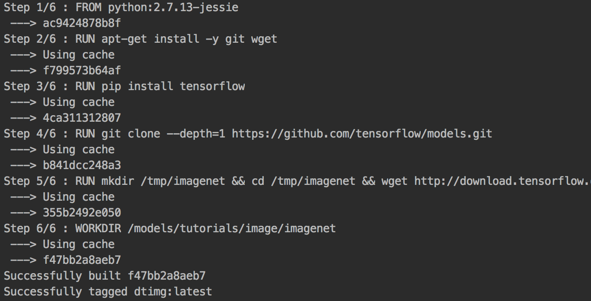
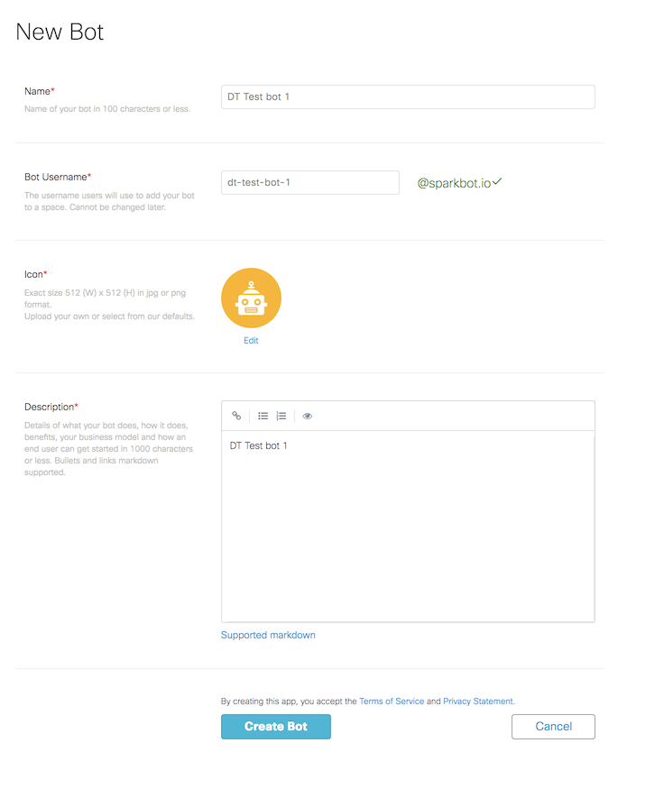

# DesignThinking SparkBot prototype with TensorFlow 

## Description
In the exercise, you will build a prototype to enable image recongition capability for Cisco Spark Bot by leveraging an open source deep learning library - TensorFlow. The use case is - when customer uploads a photo of an product or error screen to Cisco spark, it will automatically identify the product and return the related topics and informations. It can help scenario such as customer support service, etc. 
The instructions in this exercise are based on Mac computer. You may need to modify some steps if you are using windows device.


## Prerequisites
1. Install [docker](https://www.docker.com/). You will see a running docker on your system bar after completion. And make sure current project folder path in the docker [file sharing](https://docs.docker.com/docker-for-mac/#file-sharing).
2. Install [Python 2.X.](https://www.python.org/downloads/) and pip. We used Python 2.7 during this workshop. You can check your python version by put this command in Terminal ```$ python --version```
3. Install Python packages `pip install -r requirements.txt` Check [this page](http://docs.python-requests.org/en/master/user/install/) for more information if you run into any issues.


## Steps
### Step1 : Clone this repo to your local
Download all files from this repo to you local computer if you have not yet. 

### Step 2 : Build a Tensorflow model and dockerize it
Let's build a deep-learning docker image based on TensorFlow with pre-training data.

Opan a new terminal window an locate to current project folder. `$ cd <your-folder-path>`

We will need to use **docker build** command to build an image form [Dockerfile](Dockerfile), and set the image title as **dtimg**. `$ docker build . -t dtimg`



### Step 3 : Start a ngrok proxy at you local as Spark Bot webhook server

We will use [ngrok](https://ngrok.com/) tool to set up connection tunnel between your computer and public cloud. 

At the previous terminal window execute this command : `ngrok http 5000` 

You will get a screen like this after completion. You will need the http forwarding url for step 6. Do not terminate this command.


### Step 4 : Create a Spark bot

You will need to create a Spark Bot - login to [https://developer.ciscospark.com/](https://developer.ciscospark.com/), and [create a new bot](https://developer.ciscospark.com/add-bot.html). Once you created your Bot, you will be able to copy the access token of your Bot.
#### Create bot

#### Create successfully


### Step 5 : Config

Now we need to use a text editor to update the **Bot access token**, **your Spark account email** and **ngrok forwarding URL** from step 3 in [config.py](config.py). 


###  Step 6 : Create spark room with bot and steup webhook via API

We will run our prewritten script to create a direct room in Spark with your Bot and add a webhook to that room. 
Open a new terminal window and local to current project folder : `$ python ciscospark.py` 

You will get a "Hello" message from the Spark Bot you created after this step. If you want to learn how to write this script, you can visit Spark Learning Modules on [Cisco DevNet](https://learninglabs.cisco.com/modules/beginning-apis). 

###  Step 7 : Start you local service

Now let's boot our local service by execute this command : `python webhook.py`

This service will do three things:
1. Listen to the spakr room and download any image you send in this room
2. Analyze the image with pre-trained Tensorflow model and recognize objects and return result
3. Call Spakr API to send that result to the spak room


You will need to keep this service running to enable the image recognition capality for your Spark Bot room.


# Let's try it


